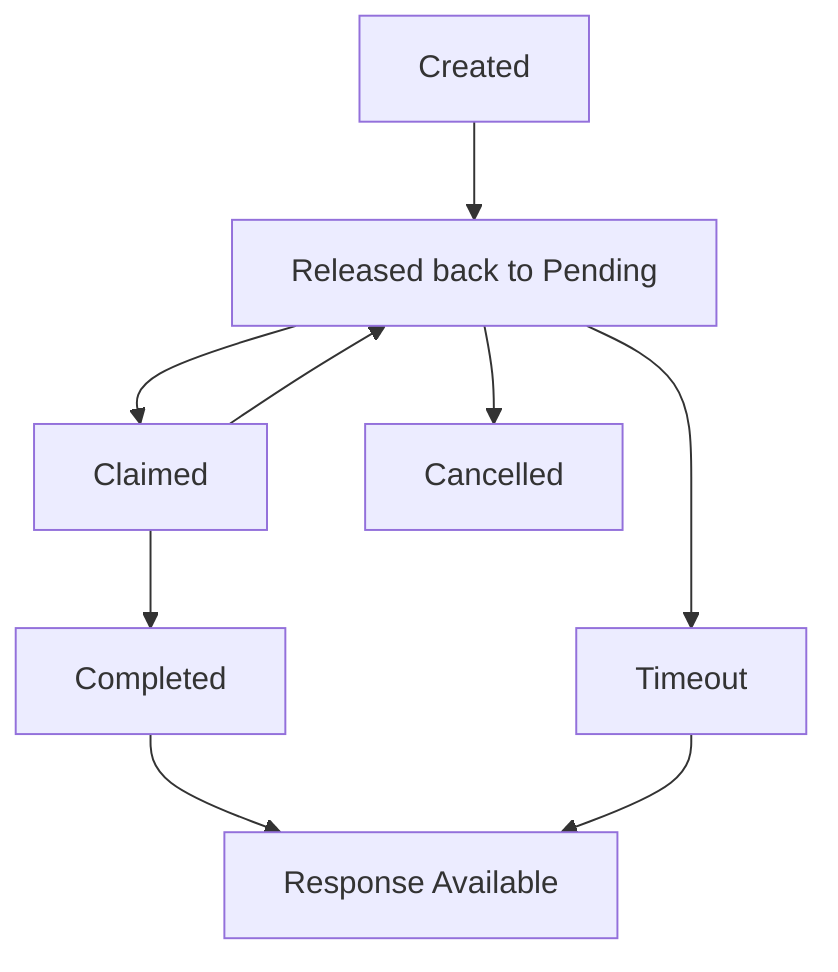

# Requests

Requests are the core units of work that flow through HITL.sh loops. Each request represents content, data, or a decision that needs human review before proceeding. Requests are created via the API, broadcasted to human reviewers, and return structured responses.

## What is a Request?

A request in HITL.sh contains:

- **Content to Review**: The actual material requiring human oversight (text, images, data)
- **Response Configuration**: How reviewers should respond (single select, rating, text, etc.)
- **Processing Settings**: Timeout behavior, priority level, and platform tracking
- **Loop Context**: Which loop handles the request and who receives notifications
- **Timeout Handling**: What happens if no human responds within the time limit

<Info>
Requests are created by API consumers and reviewed by humans via the HITL mobile app. The structured responses are then available via API polling or webhooks.
</Info>

## Request Lifecycle

### 1. Creation

Requests are created when your application needs human oversight. The API validates the request configuration and immediately broadcasts it to active loop members.

```python
import requests

# Create a content moderation request
request_data = {
    "processing_type": "time-sensitive",  # or "deferred"
    "type": "markdown",                   # or "image"
    "priority": "high",                   # low, medium, high, critical
    "request_text": "Please review this user comment for guideline compliance: 'This product changed my life! Everyone should try it. Use my referral code SAVE20 for a discount.'",
    "response_type": "single_select",
    "response_config": {
        "options": [
            {"value": "approve", "label": "✅ Approve", "color": "#22c55e"},
            {"value": "reject", "label": "❌ Reject", "color": "#ef4444"},
            {"value": "escalate", "label": "🚨 Escalate", "color": "#8b5cf6"}
        ],
        "required": True
    },
    "default_response": "reject",  # Safety default
    "timeout_seconds": 3600,       # 1 hour
    "platform": "api"
}

response = requests.post(
    f"https://api.hitl.sh/v1/api/loops/{loop_id}/requests",
    headers={"Authorization": f"Bearer {api_key}"},
    json=request_data
)

request_id = response.json()["data"]["request_id"]
```

### 2. Broadcast

Once created, requests are immediately broadcasted to all active members of the target loop:

- **Push notifications** sent to mobile devices
- **In-app notifications** appear in the HITL mobile app
- **Email alerts** (if configured) for time-sensitive requests
- **Request queuing** maintains order and prevents duplicate claims

### 3. Claiming

Human reviewers see pending requests in their mobile app and can claim them for review:

- **First-come-first-served**: The first reviewer to claim gets to respond
- **Claim timeout**: Claimed requests automatically return to pending if not completed
- **Priority ordering**: Higher priority requests appear first in the queue

### 4. Review & Response

Reviewers interact with the configured response type in a mobile-optimized interface:

- **Single select**: Tap one option from a visual list
- **Multi select**: Check multiple options with validation
- **Rating**: Drag a slider or tap star ratings
- **Text**: Type detailed feedback with character count
- **Number**: Enter numeric values with formatting
- **Boolean**: Toggle between custom-labeled true/false options

### 5. Completion

When a reviewer submits their response:

- **Validation**: Response is checked against configuration rules
- **Storage**: Response data is stored with reviewer metadata
- **Notification**: Original requester is notified (webhook/polling)
- **Status update**: Request status changes to "completed"

## Request Types

### Processing Types

<CardGroup cols={2}>
<Card title="Time-Sensitive" icon="clock">
**Immediate processing** with explicit timeout
- Requires `timeout_seconds` parameter
- Reviewers get urgent notifications
- Used for content moderation, fraud detection
- Typical timeouts: 15 minutes to 24 hours
</Card>

<Card title="Deferred" icon="calendar">
**Non-urgent processing** with flexible timeline
- Optional `timeout_seconds` (defaults to 30 days)
- Lower priority in reviewer queues
- Used for quality reviews, data verification
- Typical timeouts: 1 day to 30 days
</Card>
</CardGroup>

### Content Types

<CardGroup cols={2}>
<Card title="Markdown" icon="file-text">
**Text-based content** for review
- Request text displayed as formatted markdown
- Support for lists, links, code blocks
- Mobile-optimized text rendering
- Used for articles, comments, documents
</Card>

<Card title="Image" icon="image">
**Visual content** requiring review
- Requires `image_url` parameter
- Full-screen image viewing on mobile
- Zoom and pan capabilities
- Used for photos, graphics, screenshots
</Card>
</CardGroup>

### Priority Levels

Requests can be assigned priority levels that affect reviewer notification urgency and queue ordering:

<AccordionGroup>
<Accordion title="Critical Priority">
- Immediate push notifications
- Red highlighting in mobile app
- Appear at top of reviewer queues
- Used for security threats, policy violations
</Accordion>

<Accordion title="High Priority">
- Priority push notifications
- Orange highlighting in mobile app
- Elevated position in queues
- Used for time-sensitive business decisions
</Accordion>

<Accordion title="Medium Priority">
- Standard push notifications
- Normal highlighting in mobile app
- Default queue ordering
- Used for routine content moderation
</Accordion>

<Accordion title="Low Priority">
- Minimal notifications
- Subtle highlighting in mobile app
- Lower position in queues
- Used for quality improvements, feedback
</Accordion>
</AccordionGroup>

## Response Types

HITL.sh supports six response types, each with specific configuration options:

### Text Response
Free-form text input with length validation:

```python
"response_type": "text",
"response_config": {
    "placeholder": "Provide detailed feedback...",
    "min_length": 10,
    "max_length": 500,
    "required": True
}
```

### Single Select Response
Choose one option from a predefined list:

```python
"response_type": "single_select",
"response_config": {
    "options": [
        {
            "value": "approve",
            "label": "✅ Approve Content",
            "description": "Content meets all guidelines",
            "color": "#22c55e"
        },
        {
            "value": "reject", 
            "label": "❌ Reject Content",
            "description": "Content violates policies",
            "color": "#ef4444"
        }
    ],
    "required": True
}
```

### Multi Select Response
Choose multiple options with limits:

```python
"response_type": "multi_select",
"response_config": {
    "options": [...],  # Same format as single select
    "min_selections": 1,
    "max_selections": 3,
    "required": True
}
```

### Rating Response
Numeric rating with custom scale:

```python
"response_type": "rating",
"response_config": {
    "scale_min": 1,
    "scale_max": 5,
    "scale_step": 0.5,
    "labels": {
        "1": "Poor",
        "3": "Average", 
        "5": "Excellent"
    },
    "required": True
}
```

### Number Response
Numeric input with validation and formatting:

```python
"response_type": "number",
"response_config": {
    "min_value": 0,
    "max_value": 1000,
    "decimal_places": 2,
    "prefix": "$",
    "suffix": " USD",
    "required": True
}
```

### Boolean Response
True/false decisions with custom labels:

```python
"response_type": "boolean",
"response_config": {
    "true_label": "🚨 Flag for Review",
    "false_label": "✅ Safe to Proceed",
    "true_color": "#dc2626",
    "false_color": "#16a34a",
    "required": True
}
```

## Request Status Flow

Requests move through several states during their lifecycle:



<AccordionGroup>
<Accordion title="Pending">
- Request created and broadcasted to reviewers
- Waiting for someone to claim and review
- Visible in all loop members' mobile apps
- Can be cancelled by the creator
</Accordion>

<Accordion title="Claimed">
- A specific reviewer has claimed the request
- No longer visible to other reviewers
- Reviewer has limited time to complete
- Automatically returns to pending if abandoned
</Accordion>

<Accordion title="Completed">
- Reviewer has submitted their response
- Response data is available via API
- Request can no longer be modified
- Feedback can be added by creator
</Accordion>

<Accordion title="Timeout">
- No reviewer responded within the timeout period
- Default response is used automatically
- Request is marked as completed with timeout flag
- Common for low-priority or off-hours requests
</Accordion>

<Accordion title="Cancelled">
- Creator cancelled the request before completion
- No response data available
- Can only cancel pending or claimed requests
- Used when request is no longer needed
</Accordion>
</AccordionGroup>

## Request Monitoring

### Polling for Status

Check request status programmatically:

```python
# Get specific request
response = requests.get(
    f"https://api.hitl.sh/v1/api/requests/{request_id}",
    headers={"Authorization": f"Bearer {api_key}"}
)

request_data = response.json()["data"]["request"]
status = request_data["status"]

if status == "completed":
    response_data = request_data["response_data"]
    reviewer = request_data["response_by_user"]
    print(f"Request completed by {reviewer['name']}: {response_data}")
elif status == "timeout":
    default_response = request_data["default_response"]
    print(f"Request timed out, using default: {default_response}")
```

### Batch Monitoring

Get all your requests:

```python
# Get all requests for this API key
response = requests.get(
    "https://api.hitl.sh/v1/api/requests",
    headers={"Authorization": f"Bearer {api_key}"}
)

requests_list = response.json()["data"]["requests"]

# Filter by status
pending_requests = [r for r in requests_list if r["status"] == "pending"]
completed_requests = [r for r in requests_list if r["status"] == "completed"]

print(f"You have {len(pending_requests)} pending requests")
print(f"You have {len(completed_requests)} completed requests")
```

## Advanced Features

### Context Data

Include additional context that reviewers might need:

```python
request_data = {
    "request_text": "Review this user's profile update:",
    "context": {
        "user_id": "user_12345",
        "account_type": "premium",
        "previous_violations": 2,
        "country": "US",
        "registration_date": "2023-01-15"
    },
    # ... other fields
}
```

### Callback URLs

Get notified when requests complete:

```python
request_data = {
    "request_text": "Please review this content:",
    "callback_url": "https://your-app.com/webhook/hitl/completed",
    # ... other fields
}
```

### Platform Tracking

Track which platform generated the request:

```python
request_data = {
    "request_text": "Review this automated flag:",
    "platform": "zapier",           # api, n8n, zapier, webhook, web_portal, mobile
    "platform_version": "1.2.3",   # Optional version tracking
    # ... other fields
}
```

## Error Handling

### Common Request Creation Errors

<AccordionGroup>
<Accordion title="Invalid Response Configuration">
```json
{
  "error": true,
  "msg": "Invalid response configuration",
  "data": "options array required for select response type"
}
```
**Solution**: Ensure response_config matches the response_type requirements.
</Accordion>

<Accordion title="Loop Not Found">
```json
{
  "error": true,
  "msg": "Loop not found"
}
```
**Solution**: Verify the loop ID exists and you have access to it.
</Accordion>

<Accordion title="No Active Members">
```json
{
  "error": true,
  "msg": "No active members found in the loop"
}
```
**Solution**: Ensure the loop has active members who can receive notifications.
</Accordion>

<Accordion title="Timeout Required">
```json
{
  "error": true,
  "msg": "timeout_seconds is required for time-sensitive requests"
}
```
**Solution**: Add timeout_seconds parameter for time-sensitive processing types.
</Accordion>
</AccordionGroup>

### Request Access Errors

<AccordionGroup>
<Accordion title="Access Denied">
```json
{
  "error": true,
  "msg": "Access denied to this request"
}
```
**Solution**: You can only access requests created with your API key.
</Accordion>

<Accordion title="Cannot Cancel">
```json
{
  "error": true,
  "msg": "Request cannot be cancelled in current state"
}
```
**Solution**: Only pending or claimed requests can be cancelled.
</Accordion>
</AccordionGroup>

## Best Practices

### Request Design

<Steps>
<Step title="Clear Instructions">
Write request_text that gives reviewers all the context they need to make informed decisions.
</Step>

<Step title="Appropriate Response Types">
Choose response types that match the complexity of the decision required.
</Step>

<Step title="Reasonable Timeouts">
Set timeout_seconds based on urgency and reviewer availability patterns.
</Step>

<Step title="Safe Defaults">
Always provide default_response values that represent the safest outcome.
</Step>
</Steps>

### Performance Optimization

<CardGroup cols={2}>
<Card title="Batch Operations" icon="layers">
Create multiple requests in quick succession rather than waiting for each to complete.
</Card>

<Card title="Priority Management" icon="sort">
Use priority levels strategically - too many high-priority requests reduce their effectiveness.
</Card>

<Card title="Timeout Tuning" icon="clock">
Monitor actual response times and adjust timeouts to balance urgency with completion rates.
</Card>

<Card title="Loop Balancing" icon="users">
Distribute requests across multiple loops to prevent bottlenecks and ensure coverage.
</Card>
</CardGroup>

### Quality Assurance

- **Test configurations** with simple requests before deploying complex workflows
- **Monitor completion rates** and adjust timeouts or priority levels accordingly
- **Review default responses** to ensure they align with business requirements
- **Track reviewer performance** to identify training needs or workload issues

## Next Steps

<CardGroup cols={2}>
<Card title="Response Types Guide" icon="message-circle" href="/responses/types">
Learn about all six response types and their configurations
</Card>

<Card title="Create Request API" icon="code" href="/api-reference/requests/create-request">
See the complete API reference for request creation
</Card>

<Card title="Mobile App Guide" icon="mobile" href="/mobile/responding">
Understand how reviewers interact with requests
</Card>

<Card title="Loop Management" icon="loop" href="/concepts/loops">
Learn how to set up and manage reviewer loops
</Card>
</CardGroup>