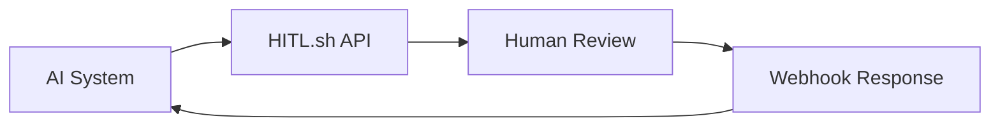

## Integration Methods

HITL.sh integrates with your existing systems through multiple channels, giving you flexibility to add human supervision without disrupting your current workflows.

## Integration Options

### Software Development Kits (SDKs)

<Columns cols={2}>
  <Card
    title="Python SDK"
    icon="python"
    href="/integrations/python"
  >
    Simple Python integration for AI applications and workflows
  </Card>
  <Card
    title="TypeScript SDK"
    icon="typescript"
    href="/integrations/typescript"
  >
    Full-featured TypeScript SDK for Node.js and browser environments
  </Card>
</Columns>

**SDK benefits:**
- **Native language support**: Use familiar syntax and patterns
- **Type safety**: Full TypeScript definitions and Python type hints
- **Error handling**: Built-in error handling and retry logic
- **Documentation**: Comprehensive examples and API reference

### Workflow Automation Tools

<Columns cols={2}>
  <Card
    title="n8n Integration"
    icon="n8n"
    href="/integrations/n8n"
  >
    Native n8n node for seamless workflow automation
  </Card>
  <Card
    title="Make.com Integration"
    icon="make"
    href="/integrations/make"
  >
    Connect HITL.sh to your Make.com scenarios
  </Card>
</Columns>

**Workflow tool benefits:**
- **Visual interface**: Drag-and-drop workflow design
- **Pre-built nodes**: Ready-to-use HITL.sh integration
- **No coding required**: Configure through UI
- **Workflow templates**: Reusable workflow patterns

### AI Framework Integrations

<Columns cols={2}>
  <Card
    title="LangGraph"
    icon="langgraph"
    href="/integrations/langgraph"
  >
    Integrate with LangGraph for sophisticated AI agent workflows
  </Card>
  <Card
    title="MCP Server"
    icon="server"
    href="/integrations/mcp"
  >
    Model Context Protocol server for AI agent communication
  </Card>
</Columns>

**AI framework benefits:**
- **Native AI workflows**: Built for AI agent architectures
- **State management**: Handle complex workflow states
- **Agent coordination**: Coordinate multiple AI agents
- **Context preservation**: Maintain context across review cycles

### Custom Integrations

<Card
  title="HTTP API"
  icon="api"
  href="/api-reference/introduction"
>
  RESTful API for custom integrations and webhook handling
</Card>

**Custom integration benefits:**
- **Full control**: Customize integration to your needs
- **Any language**: Use any programming language or framework
- **Custom logic**: Implement business-specific requirements
- **Scalability**: Handle high-volume integrations

## Integration Patterns

### Request-Response Pattern

The most common integration pattern for simple review workflows:

**Use cases:**
- Content moderation
- Quality assurance
- Simple approval workflows
- Single-step reviews

### Event-Driven Pattern

For complex workflows with multiple review steps:

**Use cases:**
- Multi-stage content creation
- Iterative improvement workflows
- Complex decision trees
- Quality gates

### Streaming Pattern

For real-time review processes:

**Use cases:**
- Live content generation
- Real-time quality control
- Interactive AI systems
- Continuous learning

## Authentication & Security

### API Keys

**Secure access:**
- **API key generation**: Create keys through the dashboard
- **Key rotation**: Regular key rotation for security
- **Scope restrictions**: Limit key permissions
- **Usage monitoring**: Track API key usage

### Webhook Security

**Secure webhooks:**
- **Signature verification**: Signed payloads for security
- **HTTPS only**: All webhooks use encrypted connections
- **Retry logic**: Automatic retry for failed deliveries
- **Rate limiting**: Protection against abuse

### Access Control

**Permission management:**
- **Role-based access**: Different permission levels
- **Team isolation**: Separate data between teams
- **Audit logging**: Complete access history
- **IP restrictions**: Optional IP whitelisting

## Performance & Reliability

### API Performance

**Optimized for speed:**
- **Low latency**: API responses in milliseconds
- **High throughput**: Handle thousands of requests per minute
- **Global distribution**: Low-latency access worldwide
- **Connection pooling**: Efficient connection management

### Webhook Reliability

**Reliable delivery:**
- **Automatic retries**: Retry failed webhook deliveries
- **Dead letter queues**: Handle permanently failed webhooks
- **Delivery confirmation**: Track webhook delivery status
- **Fallback options**: Alternative delivery methods

### Monitoring & Alerts

**Health monitoring:**
- **Uptime monitoring**: 99.9% uptime guarantee
- **Performance metrics**: Track response times and throughput
- **Error tracking**: Monitor and alert on errors
- **Integration health**: Check integration status

## Getting Started

### Choose Your Integration

**For developers:**
- Start with the SDK for your preferred language
- Use the HTTP API for custom requirements
- Check our examples and templates

**For non-developers:**
- Use n8n or Make.com integrations
- Leverage pre-built workflow templates
- Start with simple approval workflows

### Integration Checklist

**Before you start:**
- [ ] Choose integration method
- [ ] Set up HITL.sh account
- [ ] Generate API keys
- [ ] Configure webhook endpoints
- [ ] Test with sample data
- [ ] Monitor integration health

### Best Practices

**Integration tips:**
- **Start simple**: Begin with basic review workflows
- **Error handling**: Implement robust error handling
- **Monitoring**: Track integration performance
- **Documentation**: Document your integration patterns
- **Testing**: Test thoroughly before production

## Next Steps

<Card
  title="Python SDK"
  icon="python"
  href="/integrations/python"
>
  Get started with Python integration for your AI workflows.
</Card>

<Card
  title="TypeScript SDK"
  icon="typescript"
  href="/integrations/typescript"
>
  Use TypeScript for Node.js and browser integrations.
</Card>

<Card
  title="n8n Integration"
  icon="n8n"
  href="/integrations/n8n"
>
  Add human supervision to your n8n workflows.
</Card>

<Card
  title="API Reference"
  icon="book"
  href="/api-reference/introduction"
>
  Complete API documentation for custom integrations.
</Card>
